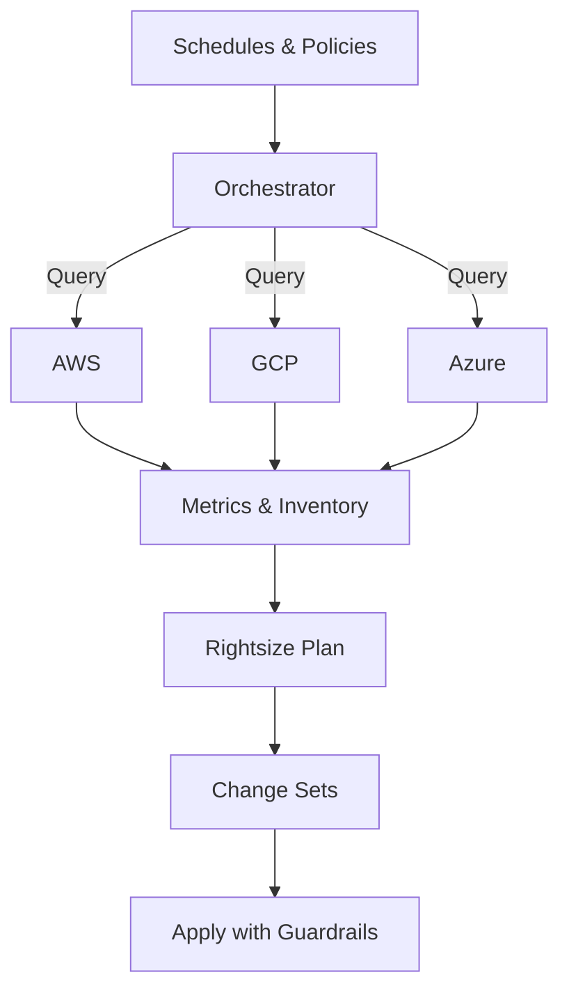

# Cloud Cost Optimization — Case Study

Modern, automated rightsizing and scheduling across AWS, GCP, and Azure delivering 35% cost reduction with zero performance impact.

<picture>
  <source media="(prefers-color-scheme: dark)" srcset="assets/social-preview.svg">
  
</picture>

## Overview
- Multi-cloud environment with rising compute costs and low utilization during off-hours
- Objective: reduce spend safely without degrading performance or developer velocity
- Result: 35% reduction in monthly cloud costs with zero downtime

## Highlights
- Automated rightsizing using instance metrics and conservative safety thresholds
- Schedules for non-critical workloads (dev/test, analytics) with override windows
- Guardrails: opt-out labels, minimum size floors, canary ramp-up, and audit logs

## Architecture
- Orchestrator: GitHub Actions + cron triggers
- Infrastructure APIs:
  - AWS: Auto Scaling, CloudWatch metrics, Instance Scheduler
  - GCP: Compute Engine, Cloud Monitoring metrics, Instance schedules
  - Azure: VM Scale Sets, Advisor recommendations, Automation schedules
- State + metrics snapshots stored in S3/Cloud Storage/Blob for diffing & audit



## Implementation Notes
- Conservative thresholds: p95 CPU < 30%, p95 Memory < 40% over 14 days
- Safety floors to avoid over-aggressive downsizing
- Canary batches, rollback on SLA breach, verbose audit trail
- Exclusion labels: `do-not-rightsize=true`, `env=prod`

## Example Policy (pseudo‑YAML)
```yaml
rightsizing:
  cpu_p95_lt: 0.30
  mem_p95_lt: 0.40
  lookback_days: 14
  min_instance_size: "2 vCPU / 8GB"
  exclude_labels:
    - do-not-rightsize=true
    - env=prod
scheduling:
  windows:
    - name: dev-offhours
      days: [Mon-Fri]
      off: 20:00
      on:  07:00
    - name: weekend-analytics
      days: [Sat,Sun]
      off: 18:00
      on:  09:00
```

## Repository Structure
```
cloud-cost-optimization/
├─ assets/
│  └─ social-preview.svg
├─ policies/
│  └─ example-policy.yaml
├─ tools/
│  ├─ collectors/
│  └─ planners/
└─ README.md
```

## Getting Started
- This repository is case‑study focused — implementation code is summarized to protect client context.
- Use the policy example above to bootstrap your own environment.
- Questions? Open an issue or reach out: david@cs-learning.me

## License
MIT © David Ortiz
